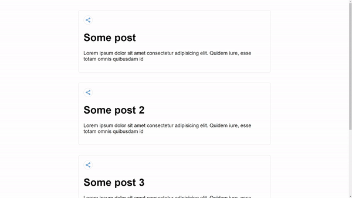

# Nuxt Social Share

[![npm version][npm-version-src]][npm-version-href]
[![npm downloads][npm-downloads-src]][npm-downloads-href]
[![License][license-src]][license-href]
[![Nuxt][nuxt-src]][nuxt-href]

Easy social share for Nuxt for doing amazing things.

- [✨ &nbsp;Release Notes](/CHANGELOG.md)
- [🏀 Online playground](https://stackblitz.com/github/Eckhardt-D/nuxt-social-share?file=playground%2Fpages%2Findex.vue)
<!-- - [📖 &nbsp;Documentation](https://example.com) -->

## Features

<!-- Highlight some of the features your module provide here -->

- 💡 &nbsp;Single customizable component for sharing
- 🚀 &nbsp;Share to Twitter, Facebook, Reddit, LinkedIn and WhatsApp
- 🔨 &nbsp;Configure where you can share to
- 🔗 &nbsp;Smart relative link parsing



## Quick Setup

1. Add `@eckidevs/nuxt-social-share` dependency to your project

```bash
# Using pnpm
pnpm add -D @eckidevs/nuxt-social-share

# Using yarn
yarn add --dev @eckidevs/nuxt-social-share

# Using npm
npm install --save-dev @eckidevs/nuxt-social-share
```

2. Add `@eckidevs/nuxt-social-share` to the `modules` section of `nuxt.config.ts`

```js
export default defineNuxtConfig({
  modules: ["@eckidevs/nuxt-social-share"],
});
```

That's it! You can now use Nuxt Social Share in your Nuxt app ✨

## Usage

### SocialShare Component Props

- `url` (optional): The url to share, defaults to location.href
- `platforms` (optional): The platforms to show share for, defaults to facebook,reddit,twitter,whatsapp,linkedin
- `text` (optional): The extra text to show with the post if supported

Simply add the component to where you want to render the share button

```vue
<template>
  <article>
    <SocialShare text="Check out this cool post!" />
    <h1>My cool post</h1>
  </article>
</template>
```

At a basic level this handles everything and uses the current `location.href` as the link to share. You can configure the share link too:

```vue
<template>
  <article>
    <SocialShare url="/relative" />
    <!-- or -->
    <SocialShare url="https://site.com/absolute" />

    <h1>My cool post</h1>
  </article>
</template>
```

The component accepts relative URLs and uses the current `location.origin` as the base URL, but also allows for any url that starts with `http` to make it absolute.

You can also specify which social platforms to show:

```vue
<template>
  <article>
    <SocialShare url="/relative" :platforms="['facebook', 'reddit']" />
    <h1>My cool post</h1>
  </article>
</template>
```

The available options are:

- facebook
- reddit
- whatsapp
- twitter
- linkedin

### Overriding Nuxt Social Share button slot

You can also use your own button for the sharing:

```vue
<template>
  <article>
    <SocialShare url="/relative">
      <template #activator="{" on }>
        <button v-on="on">Share this!</button>
      </template>
    </SocialShare>

    <h1>My cool post</h1>
  </article>
</template>
```

<!-- Badges -->

[npm-version-src]: https://img.shields.io/npm/v/@eckidevs/nuxt-social-share/latest.svg?style=flat&colorA=18181B&colorB=28CF8D
[npm-version-href]: https://npmjs.com/package/@eckidevs/nuxt-social-share
[npm-downloads-src]: https://img.shields.io/npm/dm/@eckidevs/nuxt-social-share.svg?style=flat&colorA=18181B&colorB=28CF8D
[npm-downloads-href]: https://npmjs.com/package/@eckidevs/nuxt-social-share
[license-src]: https://img.shields.io/npm/l/@eckidevs/nuxt-social-share.svg?style=flat&colorA=18181B&colorB=28CF8D
[license-href]: https://npmjs.com/package/@eckidevs/nuxt-social-share
[nuxt-src]: https://img.shields.io/badge/Nuxt-18181B?logo=nuxt.js
[nuxt-href]: https://nuxt.com
